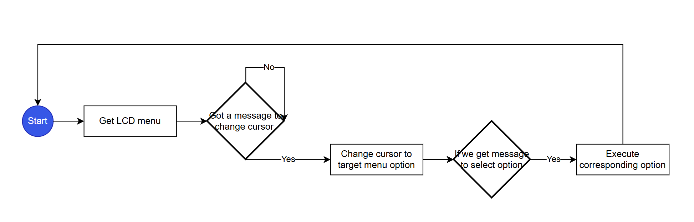
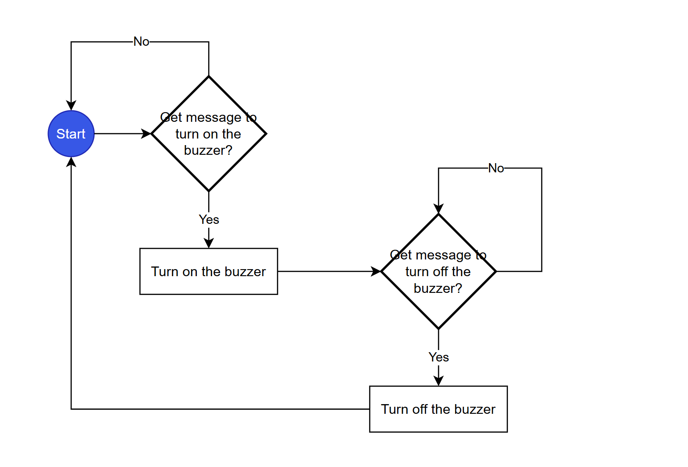
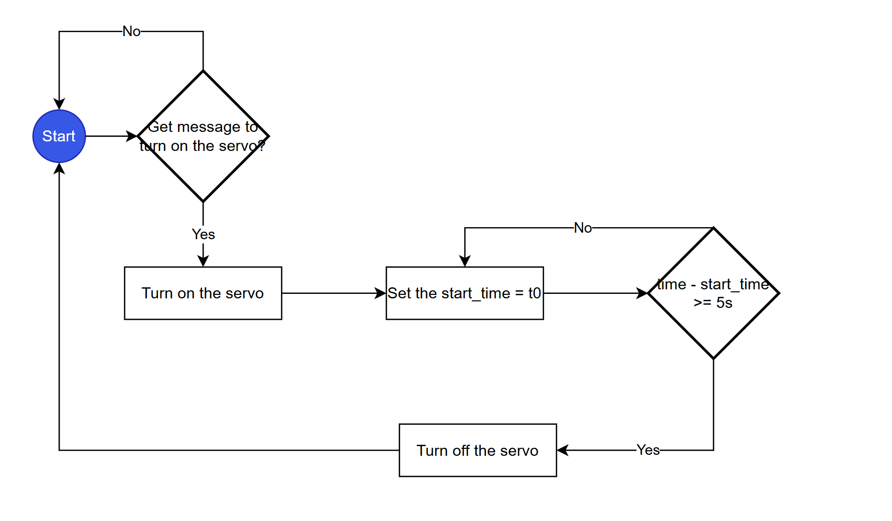
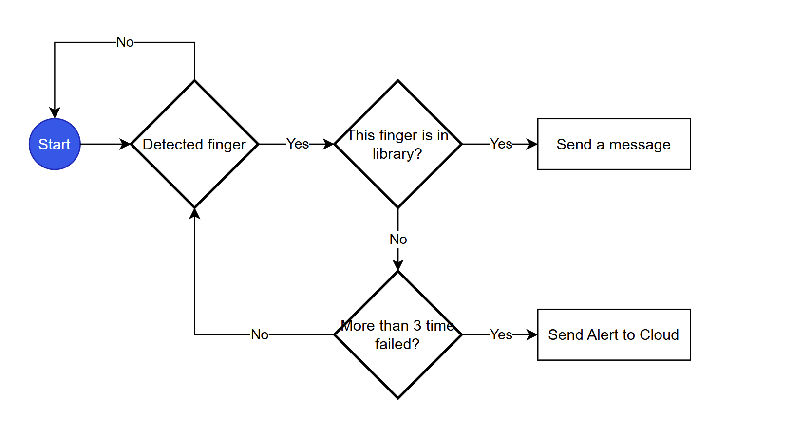
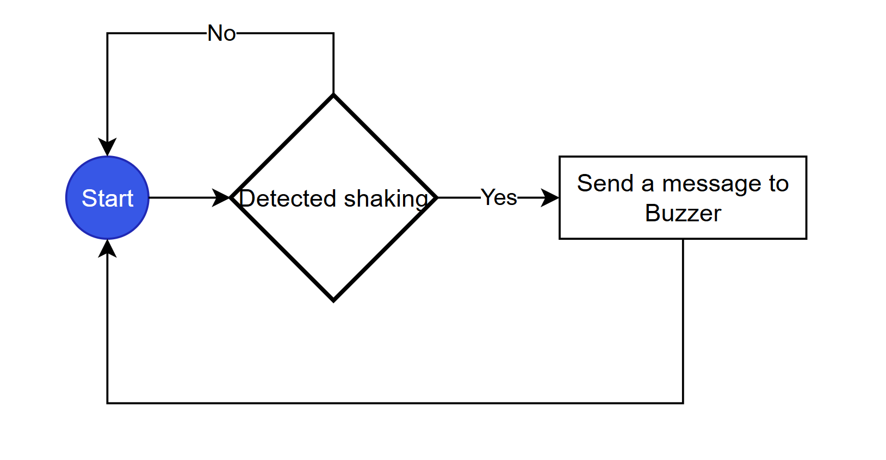
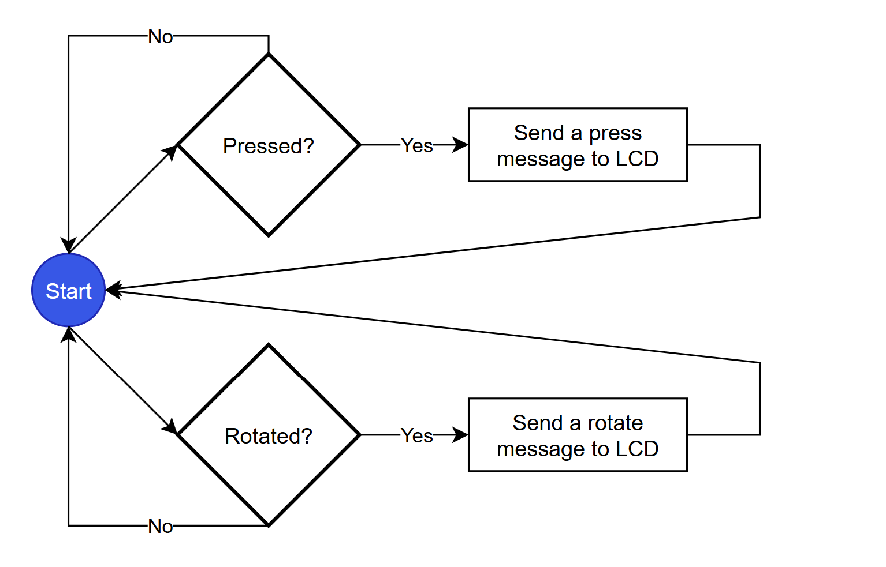

# a07g-exploring-the-CLI

* Team Number: T06
* Team Name: Byte Crafter
* Team Members: Tony Yan & Yue Zhang
* GitHub Repository URL: https://github.com/ese5160/final-project-a07g-a14g-t06-byte-crafter
* Description of test hardware: ROG Zephyrus G14, HUAWEI 14

## 1. Software Architecture

### 1. Revisit Hardware and Software Requirements Specification (HRS & SRS) in A00G

#### 1.1 Hardware Requirements Specification (HRS)

- **HRS 01:** SAMW25 microcontroller shall be used for this project.
- **HRS 02:** LCD display shall be used for user interface with correct information and the refresh rate of the screen should not be too slow (e.g. 3s), via SPI protocol.
- **HRS 03:** The rotary encoder shall allow the user to navigate the menu on the LCD and select it, through GPIO pins configured for interrupt-driven input.
- **HRS 04:** The fingerprint module shall achieve greater than 95% correctness within 1 second, via a UART interface.
- **HRS 05:** The IMU shall detect vibrations caused by violent tampering or forced entry attempts, via an I2C interface.
- **HRS 06:** The buzzer shall be sounded when specific requirements are met, driven via a PWM-capable GPIO pin.

#### 1.2 Software Requirements Specification (SRS)

- **SRS 01:** The LCD shall have a menu and allow users to add or delete fingerprints, after the master fingerprint has been successfully detected.
- **SRS 02:** The fingerprint module shall open the lock after the authorized fingerprint be detected.
- **SRS 03:** The fingerprint module shall trigger an alarm(buzzer) when it didn't detect authorized fingerprint three times or accelerometer detect someone wants to break the lock.
- **SRS 04:** The system shall send a warning message to cloud when duress fingerprint be detected.
- **SRS 05:** The system shall allow user to view real-time lock status and fingerprint library via cloud.
- **SRS 06:** The system shall allow user to open or close the lock via the cloud.
- **SRS 07:** The system shall allow user to add or delete fingerprint via the cloud.
- **SRS 07:** The system shall lock itself after 5s after open.

### 2. Block diagram outlining the different tasks

Please see below diagram for our project:  

### 3. Flowcharts or state machine diagram

Please see below flowcharts for our tasks:

1. LCD flowchart: 
2. Buzzer flowchart: 
3. Servo flowchart: 
4. Fingerprint flowchart: 
5. IMU flowchart: 
6. Rotary Encoder flowchart: 

## 2. Understanding the Starter Code

### 2.1
*InitializeSerialConsole()* function is used to initialize the UART and register the callback function, the main purpose is to prepare the serial port for communication: 1. Initialize Ring Buffers (Circular Buffers); 2. Configure USART (Universal Synchronous/Asynchronous Transceiver); 3. Setting Interrupt Priority; 4. Initiate Serial Data Read.

cbufRx is a Circular Buffer that points to the rxCharacterBuffer, which is used to store data received from the serial port;
cbufTx is a Circular Buffer that points to the txCharacterBuffer, which holds the data to be sent.

Data structure: FIFO

### 2.2

cbufRx and cbufTx are initialized by *circular_buf_init()*, which allocates a *circular_buf_t* structure and they contain pointers to rxCharacterBuffer and txCharacterBuffer, respectively. These arrays serve as the data storage for the circular buffer, where incoming and outgoing serial port data is stored. The function also sets the maximum storage size of the circular buffer based on the size of these arrays. Additionally, the buffer must be cleared (using *circular_buf_reset()*) to ensure proper initialization.

Library: *circular_buffer.c*

### 2.3

RX: 
Array: rxCharacterBuffer[];
Size: RX_BUFFER_SIZE

TX: 
Array: txCharacterBuffer[]; 
Size: TX_BUFFER_SIZE

### 2.4

*configure_usart_callbacks()*

### 2.5

a. RX: usart_write_callback

b. TX: usart_read_callback
### 2.6

*usart_write_callback*: Get the next character to be sent from cbufTx and continue the send operation.

*usart_read_callback*: Put the received data into cbufRx for subsequent processing.

### 2.7

### 2.8

UART transmission:

### 2.9

Functions:
1. Initialize and create FreeRTOS tasks.
2. Prints the heap memory size before and after task creation.

One thread (CLI_TASK) is started for the project.

## 3. Debug Logger Module

## 4. Wiretap the convo

## 5. Complete the CLI

## 6. Add CLI commands

## 7. Using Percepio
